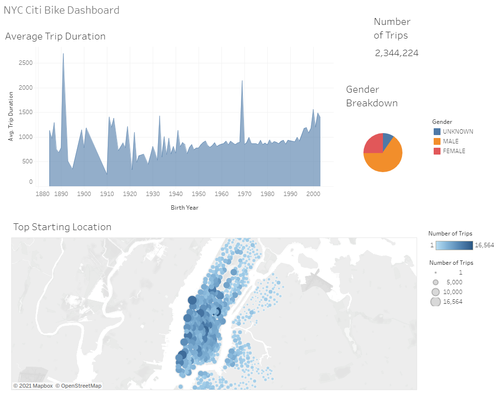
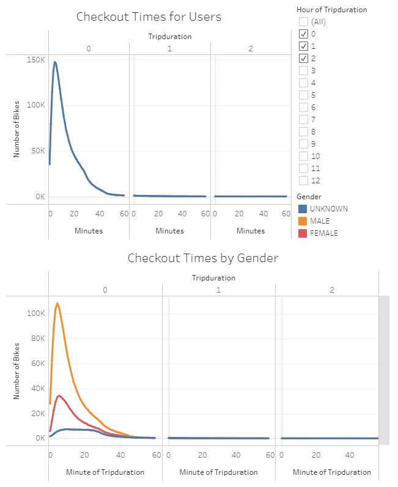
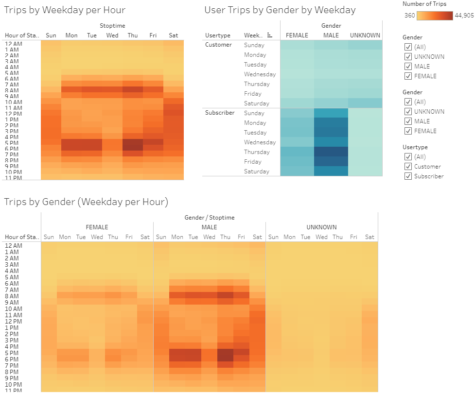
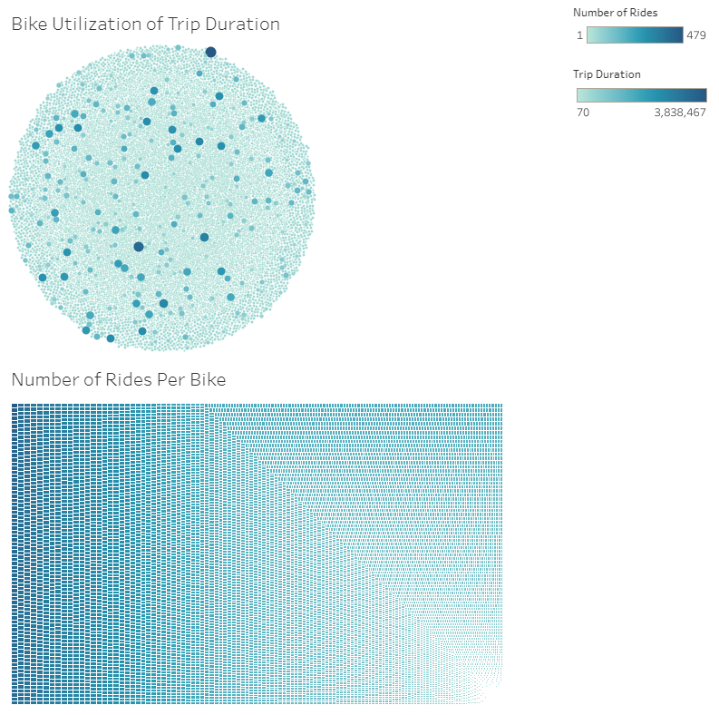

# bikesharing
There is still some more work to be done to convince investors that a bike-sharing program in Des Moines is a solid business proposal. To solidify the proposal, one of the key stakeholders would like to see a bike trip analysis: [link to dashboard](https://public.tableau.com/app/profile/john.janzen/viz/NYCBike_16230379297190/NYCStory)

## Overview of the Analysis
We're showing a general analysis of the bike trip data to show to the stakeholders and show them why it would be a good fit for them. We have a lot of data showing high recurring usage of these bikes as well as a large market being people working 9-5 jobs which can give a lot of eco friendly avenues for advertising.

## Results

In this initial overview you can see the general data. For example, there's a huge number of trips and the bike usage is going up as the younger generations grow up. You can also see the usage is very spread out over all of NYC, showing that this isn't just an idea for downtown areas.

This shows the average hours/minutes each trip is as well as the same data split out by gender. You can see this is much more popular with males and the trip lengths are anywhere from a couple of minutes to 20-40 minutes.

This shows the weekly statistics which show very heavy usage around the hours before and after work, suggesting many people use it to get to and from work as well as a more general usage on the weekends. You can also see a much higher and more steady usage with subscribers, suggesting it's a sustainable business as many people will use it continually.

This data is more for use to show you the number bikes in use along with how long each bike is in use (in the circular plot) and the number of times a bike is taken out (in the rectangular plot). 

## Summary
You can see this is a very successfull business in NYC with a huge number of trips in a single month and seemingly a high amount of people using the bikes to get to and from work which allows you to advertise as an environmentally friendly company
- You may also want to pull data that shows the distance travelled by using the start/end station lat/lon data
- Or maybe plotting the time of day and start/end locations to see at what times people are going to certain locations. I would assume during the week in the morning you'd see most people going to the more downtown areas and the opposite in the afternoons. But it may be interesting to see what happens on the weekend, where do people generally seem to go?
